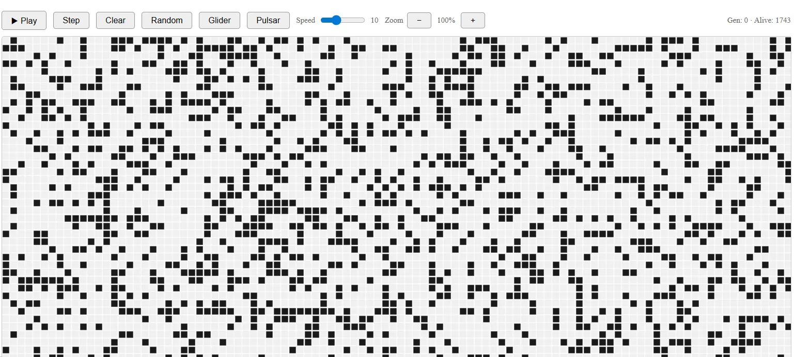

# Conway's Game of Life

A web-based interactive implementation of John Conway's famous cellular automaton, The Game of Life. This project simulates how complex, organic-like behaviors can emerge from a few simple mathematical rules. The application is fully localized and available in both English and German.

[Live Demo](https://nicohartmann.dev/conways_game_of_life_en.html)




## What is the Game of Life?

The Game of Life is a zero-player game, meaning its evolution is determined by its initial state, requiring no further input. It takes place on an infinite, two-dimensional grid of orthogonal square cells, each of which is in one of two possible states: alive (black) or dead (white).
The Rules

Every cell interacts with its eight neighbors (horizontal, vertical, and diagonal). At each step in time (generation), the following transitions occur:

- Underpopulation: Any live cell with fewer than two live neighbors dies.
- Survival: Any live cell with two or three live neighbors lives on to the next generation.
- Overpopulation: Any live cell with more than three live neighbors dies.
- Reproduction: Any dead cell with exactly three live neighbors becomes a live cell.

## Features

- Interactive Grid: Click on cells to toggle them between alive and dead states manually.
- Simulation Controls: * Play / Pause the simulation.
- Step through the simulation one generation at a time.
- Clear the entire grid to start fresh.
- Pre-configured Presets: Instantly spawn famous structures like the Glider or the Pulsar oscillator.
- Randomized Generation: Generate a chaotic, randomized board with a single click.
- Performance Adjustments: Control the simulation speed and zoom levels dynamically.
- Real-time Statistics: Track the current generation count and the total number of alive cells.

## Tech Stack

- HTML5: For the page structure and layout UI.
- CSS3: For styling, custom control sliders, and responsive grid aesthetics.
- JavaScript: For the core game logic, state management, and grid rendering.

## Getting started

To run this project locally, follow these simple steps:
1. Clone the Repository
```bash
git clone https://github.com/kt-NicoHartmann/Conways-Game-Of-Life.git
```


2. Open the Project

Navigate into the project directory and open the index.html file in your preferred web browser.

```bash
cd Conways-Game-Of-Life
# On macOS/Linux:
open conways_game_of_life_en.html
# On Windows:
start conways_game_of_life_en.html
```

Alternatively, you can use an extension like Live Server in VS Code to host it locally.
